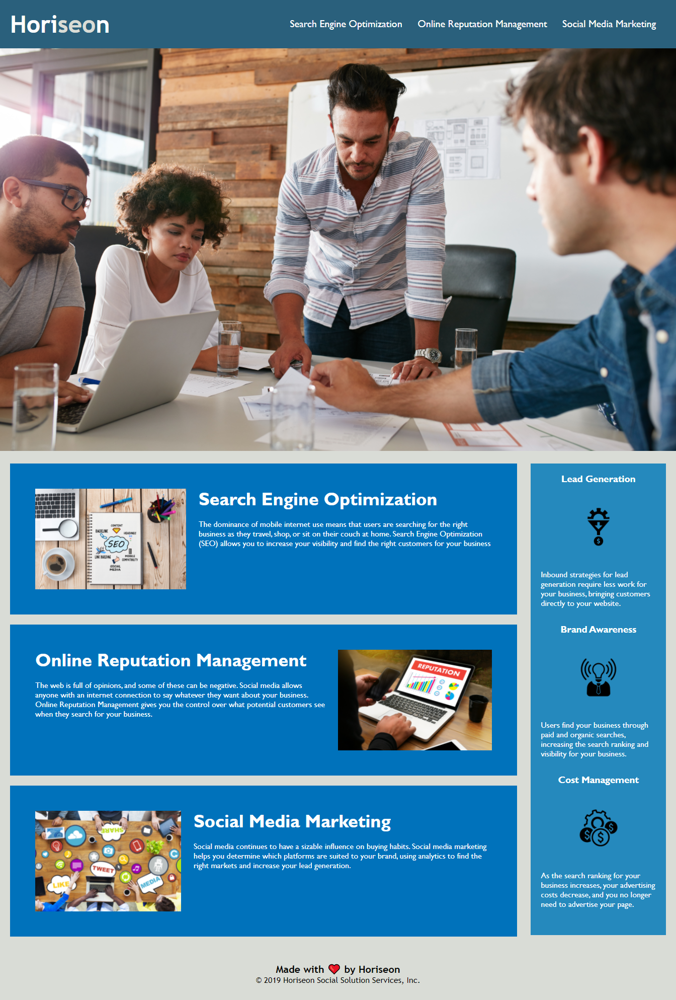

# readme

This repository contains refactored code for Horiseon's homepage. This was done to make the HTML & CSS more effecient, as well as to improve accessibility for the site.

## HTML
In order to improve accessibilty in the HTML, the following was done:    
1. Added a number of symantic HTML tags, to help with organization understanding, for both accesibilty readers for search engines. 
2. Added alt tags so accesibilty readers and search engines would know what the images were showing. 

## CSS
In order to make the CSS more effecient, the following was done:
1. There were multiple classes sharing the same styles, these were combined
2. In some cases, CSS selector classes were removed by selecting HTML symantic tags and their children tags instead.

These updates can be seen on the web by [clicking here:](https://samvauclain.github.io/mod-1-challenge/)

Screenshot of Project:

